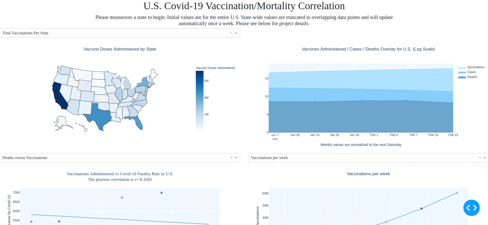

[](https://GitHub.com/Naereen/ama)
[](https://www.python.org/)
[](https://opensource.org/licenses/MIT)


# Covid-19 Vaccination - Mortality Correlation
This project stemmed from my desire to create a simple dashboard visualizing correlation between vaccination and mortality in the Covid-19 pandemic as the vaccination effort progresses in 2021. The dashboard for this project is deployed here: http://covid-correlation-dev.us-west-2.elasticbeanstalk.com/

# Motivation
Amidst the horrifying tragedy of the Covid pandemic, we as a species have a unique opportunity to witness the power of science to change the course of a disease through the use of vaccines. This is the first such effort at mass-vaccination in the United Stats since the advent of the internet, and therefore we now have an opportunity as a culture to disseminate information and facts about the impact of the vaccine and potentially cultivate and reinforce faith in scientific process among Americans. This dashboard is an effort to contribute to this by providing simple visualizations that directly show how increasing vaccination rates relate to covid mortality.
# Framework
Python - 3.8 <br />
numpy - 1.19.2 
Scikit-Learn - 0.23.2<br />
dash - 1.19<br />
pandas - 1.2.1<br />
plotly - 4.14.3<br />

# Figure Samples


# Code Sample
```
def fix_date_label(input_string, stamp = False, shift = 0):
    '''
    Converts the CDC API output labels to timestamps
    :param input_string: str
        The column head from the API's output.
    :param stamp: bool
        Boolean to return a datetime object or a string.
    :param shift: int
        Amount (days) to shift date by if so desired.
    :return: str
        Timestamp string 'YYYY-MM-DD'
    '''
    input_string = re.sub('^\\D*', '', input_string)
    month_day = input_string.split('_')
    if int(month_day[0]) == 12:
        timestamp = '2020-12-{}'.format(month_day[1])
    else:
        timestamp = '2021-{}-{}'.format(month_day[0], month_day[1])

    try:
        timestamp = dt.date.fromisoformat(timestamp)
    except ValueError:
        print('Source date-time label/format/standards have changed.')
    if shift > 0:
        timestamp += dt.timedelta(days=shift)
    if stamp:
        return timestamp
    else:
        return str(timestamp)
```

